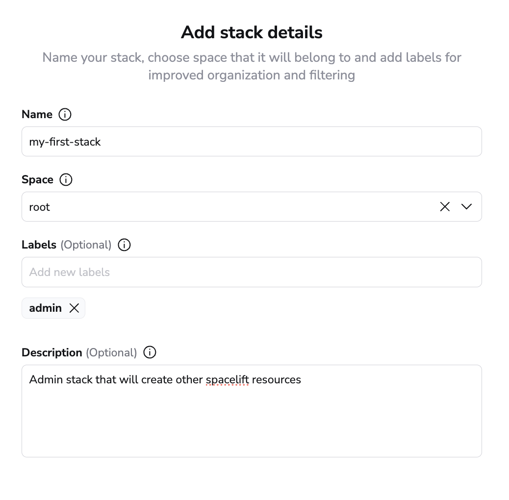
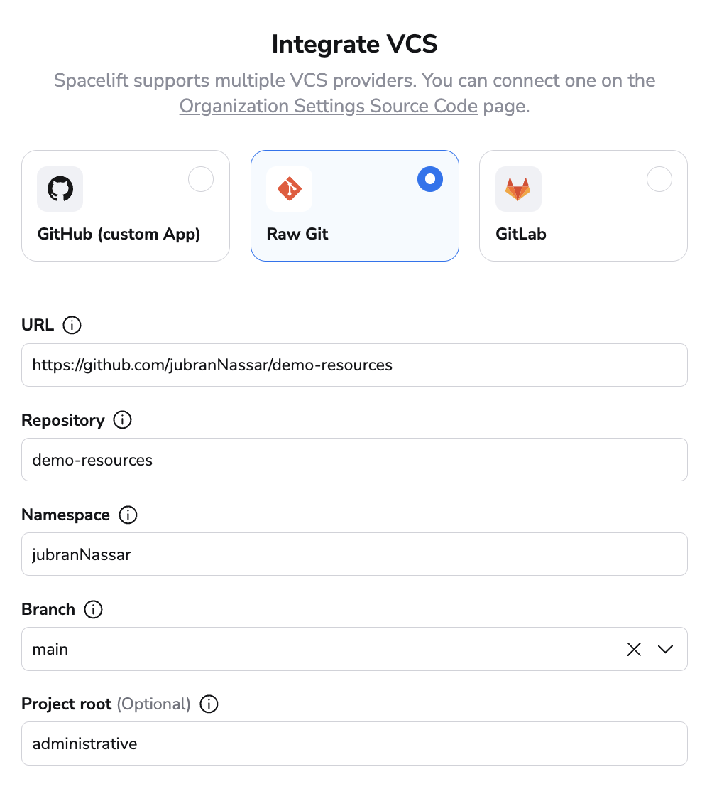
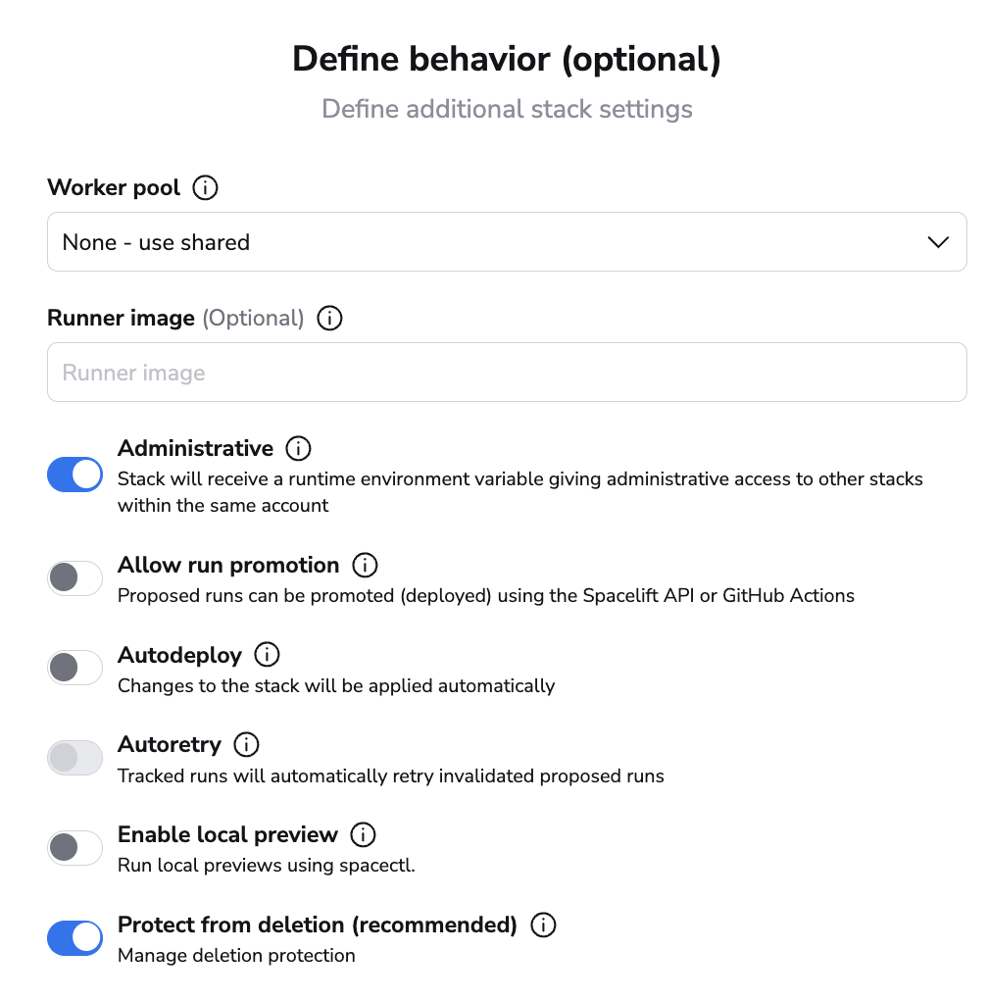

# Demo Resources

This repository will give you a simple exercise to create an administrative stack that will then create sample resources in your spacelift account.

## prerequesites

* spacelift account with admin permissions

### creating the admin stack

Once you click on `Create stack`, give your stack a name and specify which space you want this to live in, all other fields are optional.

> ⚠️ **Pro tip: you typically want to have the administrative stack in the root space, so it can create resources in any child space**

For this exercise, we will select `Raw Git` as our VCS provider. For the `URL` field, we will provide the URL of this repository, `https://github.com/jubranNassar/demo-resources`. Once thats provided, all other fields will be populated automatically, the only thing we need to specifiy is the `Project root`, we'll set that to `administrative`.

We won't make any changes to the vendor section, it defaults to terraform, so we'll just click continue.

In the behavior screen the only thing we need to ensure is that the stack is `Administrative`

We will skip until summary and hit `Create stack`